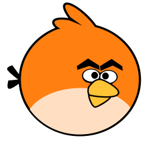

# godot-tutorials
A collection of beginner-friendly Godot projects used in my YouTube tutorials. Simple, clean and focused on learning by doing.

| Project | Description | Level | Youtube Tutorial |
|---------|-------------|-------|------------------|
| [   FlappyFox](/Projects/FlappyFox) | A Simple Flappy Bird Clone | Beginner | [Your First 2D Game in Godot 4](#) |